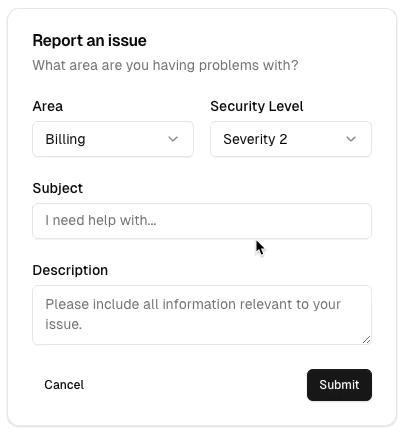

# UI

- 设计参考 shadcn/ui 并进行风格微调
- library 使用 daisyUI

## Component

- core_component for stateless component, Phoenix.Component
- live/components for stateful component, Phoenix.LiveComponent

## Don't use SurfaceUI

Why?

- config is too complex
  - setup mistake is easy, have to upgrade after liveview upgrade
  - build effect, config, Dockerfile and Docker image size.
- liveview is good enough, surface-ui is cost

## Button

> less, butter better.

style (color)

1. default: outline
2. submit, save: accent color
3. danger: error color

- form's save and cancel button
  - save: primary
  - cancel: ghost

shadcn/ui form cancel button is a ghost button.

